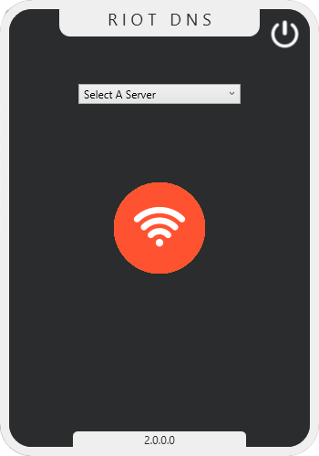

# RiotDNS
RiotDNS — Switch Your Windows DNS Fast & Easy!
Find, Pick, Set — Done in Seconds!
 

Open Source Under MIT Noncommercial License.
# IMPORTANT
🔰 This project will receive updates, though slowly. However, feel free to contribute!
 
🔰 GoodLuck 
# Changelog
v1.0.0.0 :  
✅ Official Release (Basic Version)!
  
v1.0.0.1 :  
✅ Minor bugs have been fixed!
  
v1.0.0.2 :  
✅ Added self-updater feature!
  
v1.0.0.3 :  
✅ UI/UX improvements implemented!
  
v2.0.0.0 :  
✅ New design rebuilt using WPF!
  
v2.0.1.0 :  
✅ Code optimized for better performance and readability!
  
✅ Added a simple logging system for tracking events and errors!
  
v2.0.2.0 :  
✅ Fixed a bug in the updater system!
 
✅ Fixed bug in DNS clear and set action!
  
v2.0.2.1 :
 
✅ Added a simple splash screen!
 
✅ Fixed minor bugs!
 
✅ Application code optimized, resulting in improved speed and performance!
 
✅ Now, when you start DNS, the ping will be displayed!
 
✅ New servers have been added!
  
v2.0.2.2 :
 
✅ Adjustments made to splash screen and icons!
  
v2.0.2.3 :
 
✅ Added a new DNS server!
 
✅ Fixed application freezing issue when trying to activate a DNS!
  
v2.0.2.4 :
 
✅ Crash log feature included!
  
v2.0.2.5 :
 
✅ Basic improvements made!
  
v2.0.2.6 :
 
✅ Fixed some minor bugs!
  
v2.0.2.7 :
 
✅ Library updates!
# Known Issue's
⚠ Application Core: The app may not work correctly if multiple network adapters are active.
# ToDo List
💢 Add a custom section to let users add their own DNS servers.
 
💢 And much more :)
# Builds And Download

 
Note: Screenshot is related to version (2.0.0.0)
| Operation System | Download Link                                                                      |
| ------------ | -------------------------------------------------------------------------------------- |
| Windows       | <a href="https://github.com/RealUnfazed/RiotDNS/releases/download/main/RiotDNS_Compiled_Windows.zip">Download</a> |
